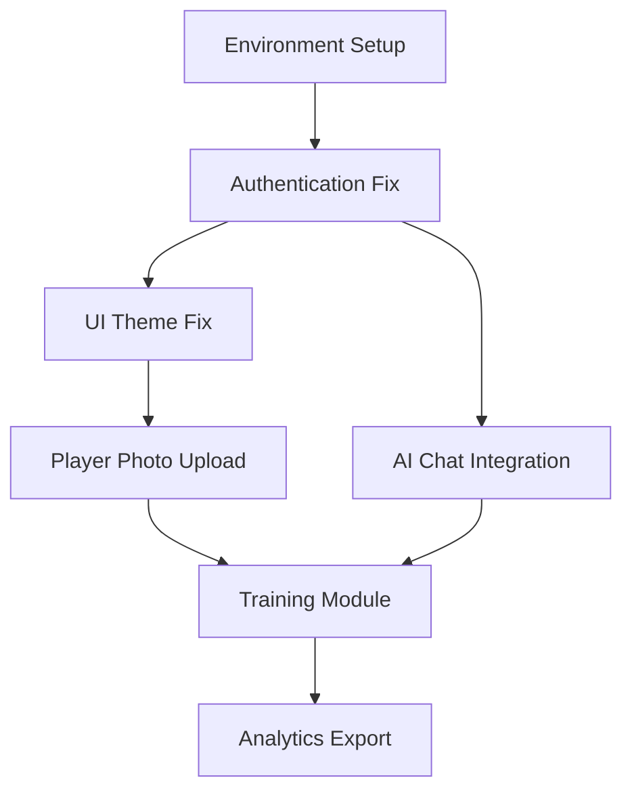

# Sports Team Management Application - Technical Assessment & Solutions

## Executive Summary

This assessment addresses 6 critical areas affecting the sports team management application's functionality, user experience, and reliability. The analysis includes root cause identification, technical solutions, and implementation roadmap.

## Issue Analysis & Solutions

### 1. Authentication System Issues

#### Root Cause Analysis
- **Google OAuth Configuration**: Missing or incorrect environment variables
- **CORS Issues**: Improper cross-origin configuration for OAuth callbacks
- **Session Management**: Inadequate token handling and logout flow
- **Redirect URI Mismatches**: Development vs production URL inconsistencies

#### Technical Solutions

**Priority: CRITICAL**
**Effort: 8-12 hours**

##### Environment Configuration
```typescript
// .env.local (create this file)
VITE_GOOGLE_CLIENT_ID=your_google_client_id_here
VITE_GOOGLE_CLIENT_SECRET=your_google_client_secret_here
VITE_API_BASE_URL=http://localhost:3000
VITE_FRONTEND_URL=http://localhost:8080
```

##### Enhanced Auth Context Implementation
```typescript
// src/contexts/AuthContext.tsx - Enhanced version
const handleGoogleCallback = async (token: string) => {
  try {
    setLoading(true);
    const response = await authAPI.verifyGoogleToken(token);
    if (response.data.success) {
      const { user, token: authToken } = response.data.data;
      setUser(user);
      localStorage.setItem('auth_token', authToken);
      localStorage.setItem('statsor_user', JSON.stringify(user));
      return { data: { user }, error: null };
    }
    return { data: null, error: response.data.message };
  } catch (error) {
    return { data: null, error: 'Authentication failed' };
  } finally {
    setLoading(false);
  }
};
```

##### CORS Configuration
```typescript
// Backend CORS setup (if using Express)
app.use(cors({
  origin: [
    'http://localhost:8080',
    'https://your-production-domain.com'
  ],
  credentials: true,
  methods: ['GET', 'POST', 'PUT', 'DELETE', 'OPTIONS'],
  allowedHeaders: ['Content-Type', 'Authorization', 'X-Requested-With']
}));
```

### 2. Player Management - Profile Picture Upload

#### Root Cause Analysis
- **Missing Upload Infrastructure**: No file upload service integration
- **Image Processing**: Lack of image optimization and validation
- **Storage Solution**: No cloud storage configuration

#### Technical Solutions

**Priority: HIGH**
**Effort: 12-16 hours**

##### File Upload Service Integration
```typescript
// src/services/uploadService.ts
interface UploadResult {
  success: boolean;
  url?: string;
  error?: string;
}

class UploadService {
  async uploadPlayerPhoto(file: File, playerId: string): Promise<UploadResult> {
    try {
      // Validate file
      if (!this.isValidImageFile(file)) {
        return { success: false, error: 'Invalid file type' };
      }

      // Compress image
      const compressedFile = await this.compressImage(file);
      
      // Upload to cloud storage (Cloudflare R2/AWS S3)
      const formData = new FormData();
      formData.append('file', compressedFile);
      formData.append('playerId', playerId);

      const response = await fetch('/api/upload/player-photo', {
        method: 'POST',
        headers: {
          'Authorization': `Bearer ${localStorage.getItem('auth_token')}`
        },
        body: formData
      });

      const result = await response.json();
      return result;
    } catch (error) {
      return { success: false, error: 'Upload failed' };
    }
  }

  private isValidImageFile(file: File): boolean {
    const validTypes = ['image/jpeg', 'image/png', 'image/webp'];
    const maxSize = 5 * 1024 * 1024; // 5MB
    return validTypes.includes(file.type) && file.size <= maxSize;
  }

  private async compressImage(file: File): Promise<File> {
    return new Promise((resolve) => {
      const canvas = document.createElement('canvas');
      const ctx = canvas.getContext('2d')!;
      const img = new Image();
      
      img.onload = () => {
        const maxWidth = 400;
        const maxHeight = 400;
        let { width, height } = img;

        if (width > height) {
          if (width > maxWidth) {
            height = (height * maxWidth) / width;
            width = maxWidth;
          }
        } else {
          if (height > maxHeight) {
            width = (width * maxHeight) / height;
            height = maxHeight;
          }
        }

        canvas.width = width;
        canvas.height = height;
        ctx.drawImage(img, 0, 0, width, height);
        
        canvas.toBlob((blob) => {
          resolve(new File([blob!], file.name, { type: 'image/jpeg' }));
        }, 'image/jpeg', 0.8);
      };
      
      img.src = URL.createObjectURL(file);
    });
  }
}

export const uploadService = new UploadService();
```

### 3. UI/UX Issues - Dark Theme Problems

#### Root Cause Analysis
- **Insufficient Color Contrast**: Poor text visibility in dark mode
- **Missing Dark Mode Variables**: Incomplete CSS custom properties
- **Component-Level Styling**: Hardcoded colors not respecting theme

#### Technical Solutions

**Priority: HIGH**
**Effort: 6-8 hours**

##### Enhanced Theme System
```css
/* src/index.css - Enhanced dark mode variables */
.dark {
  --background: 222.2 84% 4.9%;
  --foreground: 210 40% 98%;
  --card: 222.2 84% 4.9%;
  --card-foreground: 210 40% 98%;
  --popover: 222.2 84% 4.9%;
  --popover-foreground: 210 40% 98%;
  --primary: 142 76% 36%;
  --primary-foreground: 210 40% 98%;
  --secondary: 217.2 32.6% 17.5%;
  --secondary-foreground: 210 40% 98%;
  --muted: 217.2 32.6% 17.5%;
  --muted-foreground: 215 20.2% 65.1%;
  --accent: 217.2 32.6% 17.5%;
  --accent-foreground: 210 40% 98%;
  --destructive: 0 62.8% 30.6%;
  --destructive-foreground: 210 40% 98%;
  --border: 217.2 32.6% 17.5%;
  --input: 217.2 32.6% 17.5%;
  --ring: 142 76% 36%;
}

/* Ensure proper contrast for all text elements */
.dark .text-gray-900 { color: rgb(243 244 246); }
.dark .text-gray-800 { color: rgb(229 231 235); }
.dark .text-gray-700 { color: rgb(209 213 219); }
.dark .text-gray-600 { color: rgb(156 163 175); }
.dark .text-gray-500 { color: rgb(107 114 128); }

/* Card backgrounds in dark mode */
.dark .bg-white { background-color: rgb(31 41 55); }
.dark .bg-gray-50 { background-color: rgb(55 65 81); }
.dark .bg-gray-100 { background-color: rgb(75 85 99); }
```

##### Theme-Aware Component Updates
```typescript
// src/components/ui/card.tsx - Theme-aware styling
const Card = React.forwardRef<
  HTMLDivElement,
  React.HTMLAttributes<HTMLDivElement>
>(({ className, ...props }, ref) => (
  <div
    ref={ref}
    className={cn(
      "rounded-lg border bg-card text-card-foreground shadow-sm transition-colors",
      "dark:bg-gray-800 dark:border-gray-700 dark:text-gray-100",
      className
    )}
    {...props}
  />
))
```

### 4. Training Module Enhancements

#### Root Cause Analysis
- **Missing Persistence**: Session data not saved to database
- **Incomplete Share Feature**: No sharing mechanism implemented
- **Broken PDF Export**: Missing PDF generation library
- **Attendance Coupling**: Unnecessary feature dependency

#### Technical Solutions

**Priority: MEDIUM**
**Effort: 16-20 hours**

##### Session History Implementation
```typescript
// src/services/trainingService.ts
interface TrainingSession {
  id: string;
  name: string;
  exercises: Exercise[];
  totalDuration: number;
  createdAt: Date;
  updatedAt: Date;
  createdBy: string;
}

class TrainingService {
  async saveSession(session: Omit<TrainingSession, 'id' | 'createdAt' | 'updatedAt'>): Promise<TrainingSession> {
    try {
      const response = await api.post('/training/sessions', session);
      return response.data.data;
    } catch (error) {
      throw new Error('Failed to save training session');
    }
  }

  async getSessionHistory(userId: string): Promise<TrainingSession[]> {
    try {
      const response = await api.get(`/training/sessions?userId=${userId}`);
      return response.data.data;
    } catch (error) {
      throw new Error('Failed to load session history');
    }
  }

  async shareSession(sessionId: string, shareOptions: ShareOptions): Promise<string> {
    try {
      const response = await api.post(`/training/sessions/${sessionId}/share`, shareOptions);
      return response.data.shareUrl;
    } catch (error) {
      throw new Error('Failed to share session');
    }
  }
}
```

##### PDF Export Implementation
```typescript
// src/utils/pdfExport.ts
import jsPDF from 'jspdf';
import html2canvas from 'html2canvas';

export class PDFExportService {
  async exportTrainingSession(session: TrainingSession): Promise<void> {
    try {
      const pdf = new jsPDF();
      
      // Add header
      pdf.setFontSize(20);
      pdf.text(session.name, 20, 30);
      
      // Add session details
      pdf.setFontSize(12);
      pdf.text(`Duration: ${session.totalDuration} minutes`, 20, 50);
      pdf.text(`Created: ${session.createdAt.toLocaleDateString()}`, 20, 60);
      
      // Add exercises
      let yPosition = 80;
      session.exercises.forEach((exercise, index) => {
        pdf.text(`${index + 1}. ${exercise.name}`, 20, yPosition);
        pdf.text(`   Duration: ${exercise.duration} min | Players: ${exercise.players}`, 20, yPosition + 10);
        pdf.text(`   Objective: ${exercise.objective}`, 20, yPosition + 20);
        yPosition += 40;
        
        if (yPosition > 250) {
          pdf.addPage();
          yPosition = 30;
        }
      });
      
      pdf.save(`${session.name}.pdf`);
    } catch (error) {
      throw new Error('PDF export failed');
    }
  }
}
```

### 5. Tactical AI Chat Enhancement

#### Root Cause Analysis
- **No AI Integration**: Missing connection to AI service
- **Static Responses**: Hardcoded, non-contextual replies
- **Poor UX**: No conversation flow or history
- **Missing Context**: No awareness of user's team/sport data

#### Technical Solutions

**Priority: HIGH**
**Effort: 20-24 hours**

##### AI Service Integration
```typescript
// src/services/aiChatService.ts
interface ChatMessage {
  id: string;
  type: 'user' | 'bot';
  content: string;
  timestamp: Date;
  context?: any;
}

interface UserContext {
  sport: 'soccer' | 'futsal';
  teamData: any;
  recentMatches: any[];
  playerStats: any[];
}

class AIChatService {
  private apiKey: string;
  private baseUrl: string;

  constructor() {
    this.apiKey = process.env.VITE_OPENAI_API_KEY || '';
    this.baseUrl = 'https://api.openai.com/v1';
  }

  async sendMessage(message: string, userContext: UserContext): Promise<string> {
    try {
      const systemPrompt = this.buildSystemPrompt(userContext);
      
      const response = await fetch(`${this.baseUrl}/chat/completions`, {
        method: 'POST',
        headers: {
          'Authorization': `Bearer ${this.apiKey}`,
          'Content-Type': 'application/json'
        },
        body: JSON.stringify({
          model: 'gpt-4',
          messages: [
            { role: 'system', content: systemPrompt },
            { role: 'user', content: message }
          ],
          temperature: 0.7,
          max_tokens: 500
        })
      });

      const data = await response.json();
      return data.choices[0].message.content;
    } catch (error) {
      return this.getFallbackResponse(message, userContext);
    }
  }

  private buildSystemPrompt(context: UserContext): string {
    return `You are an expert ${context.sport} coach assistant. 
    
    User's team context:
    - Sport: ${context.sport}
    - Recent performance: ${JSON.stringify(context.recentMatches?.slice(0, 3))}
    - Key players: ${JSON.stringify(context.playerStats?.slice(0, 5))}
    
    Provide tactical advice, formation suggestions, and strategic insights.
    Be conversational, encouraging, and specific to ${context.sport}.
    Keep responses under 200 words and actionable.`;
  }

  private getFallbackResponse(message: string, context: UserContext): string {
    const lowerMessage = message.toLowerCase();
    
    if (lowerMessage.includes('formation')) {
      return context.sport === 'soccer' 
        ? "For soccer, I recommend trying a 4-3-3 formation for balanced attack and defense. Focus on wing play and midfield control."
        : "In futsal, a 2-2 formation works well. Keep one player back for security and rotate positions frequently.";
    }
    
    if (lowerMessage.includes('training')) {
      return "Focus on possession drills and quick passing. Set up small-sided games to improve decision making under pressure.";
    }
    
    return "I'm here to help with tactical advice! Ask me about formations, training drills, or match strategies.";
  }
}
```

##### Enhanced Chat Interface
```typescript
// src/components/TacticalAIChatbot.tsx - Enhanced version
export const TacticalAIChatbot: React.FC = () => {
  const [messages, setMessages] = useState<ChatMessage[]>([]);
  const [isLoading, setIsLoading] = useState(false);
  const [userContext, setUserContext] = useState<UserContext | null>(null);
  const aiChatService = new AIChatService();

  const sendMessage = async (content: string) => {
    if (!userContext) return;

    const userMessage: ChatMessage = {
      id: Date.now().toString(),
      type: 'user',
      content,
      timestamp: new Date()
    };

    setMessages(prev => [...prev, userMessage]);
    setIsLoading(true);

    try {
      const response = await aiChatService.sendMessage(content, userContext);
      
      const botMessage: ChatMessage = {
        id: (Date.now() + 1).toString(),
        type: 'bot',
        content: response,
        timestamp: new Date()
      };

      setMessages(prev => [...prev, botMessage]);
    } catch (error) {
      console.error('Chat error:', error);
    } finally {
      setIsLoading(false);
    }
  };

  // Rest of component implementation...
};
```

### 6. Advanced Analytics Export Issues

#### Root Cause Analysis
- **Missing Export Libraries**: No PDF/Excel generation capabilities
- **Data Serialization**: Improper data formatting for export
- **File Download**: Browser download mechanism not implemented

#### Technical Solutions

**Priority: MEDIUM**
**Effort: 8-10 hours**

##### Multi-Format Export Service
```typescript
// src/services/exportService.ts
import * as XLSX from 'xlsx';
import jsPDF from 'jspdf';
import 'jspdf-autotable';

interface ExportData {
  title: string;
  data: any[];
  metadata?: any;
}

class ExportService {
  async exportToExcel(exportData: ExportData): Promise<void> {
    try {
      const workbook = XLSX.utils.book_new();
      const worksheet = XLSX.utils.json_to_sheet(exportData.data);
      
      XLSX.utils.book_append_sheet(workbook, worksheet, 'Analytics');
      XLSX.writeFile(workbook, `${exportData.title}.xlsx`);
    } catch (error) {
      throw new Error('Excel export failed');
    }
  }

  async exportToPDF(exportData: ExportData): Promise<void> {
    try {
      const pdf = new jsPDF();
      
      // Add title
      pdf.setFontSize(16);
      pdf.text(exportData.title, 20, 20);
      
      // Add data table
      const tableData = exportData.data.map(item => Object.values(item));
      const headers = Object.keys(exportData.data[0] || {});
      
      (pdf as any).autoTable({
        head: [headers],
        body: tableData,
        startY: 40,
        theme: 'grid',
        styles: { fontSize: 8 }
      });
      
      pdf.save(`${exportData.title}.pdf`);
    } catch (error) {
      throw new Error('PDF export failed');
    }
  }

  async exportToJSON(exportData: ExportData): Promise<void> {
    try {
      const jsonData = {
        ...exportData,
        exportedAt: new Date().toISOString()
      };
      
      const blob = new Blob([JSON.stringify(jsonData, null, 2)], { 
        type: 'application/json' 
      });
      
      this.downloadFile(blob, `${exportData.title}.json`);
    } catch (error) {
      throw new Error('JSON export failed');
    }
  }

  private downloadFile(blob: Blob, filename: string): void {
    const url = URL.createObjectURL(blob);
    const link = document.createElement('a');
    link.href = url;
    link.download = filename;
    document.body.appendChild(link);
    link.click();
    document.body.removeChild(link);
    URL.revokeObjectURL(url);
  }
}

export const exportService = new ExportService();
```

## Implementation Priority Matrix

### Critical Priority (Week 1)
1. **Authentication System** - Blocks core functionality
   - Environment variables setup
   - Google OAuth configuration
   - CORS fixes
   - **Effort**: 8-12 hours

### High Priority (Week 2)
2. **UI/UX Dark Theme** - Affects user experience significantly
   - CSS variable updates
   - Component theme awareness
   - **Effort**: 6-8 hours

3. **Player Photo Upload** - Core feature missing
   - Upload service implementation
   - Image processing
   - **Effort**: 12-16 hours

4. **Tactical AI Chat** - Key differentiator feature
   - AI service integration
   - Context awareness
   - **Effort**: 20-24 hours

### Medium Priority (Week 3-4)
5. **Training Module** - Feature completeness
   - Session persistence
   - PDF export
   - Share functionality
   - **Effort**: 16-20 hours

6. **Analytics Export** - Data accessibility
   - Multi-format export
   - Download mechanisms
   - **Effort**: 8-10 hours

## Dependencies & Implementation Order



## Testing Strategy

### Unit Tests
- Authentication flow testing
- File upload validation
- Theme switching functionality
- Export service methods

### Integration Tests
- Google OAuth end-to-end flow
- AI chat conversation flow
- Training session save/load
- Multi-format export validation

### User Acceptance Tests
- Dark mode usability
- Photo upload workflow
- Chat interaction quality
- Export functionality across browsers

## Risk Assessment

### High Risk
- **Google OAuth Setup**: Requires external service configuration
- **AI Integration**: Depends on third-party API availability and costs

### Medium Risk
- **File Upload**: Storage service configuration needed
- **PDF Generation**: Browser compatibility considerations

### Low Risk
- **Theme Updates**: CSS-only changes
- **Export Features**: Well-established libraries

## Estimated Total Effort

- **Critical Issues**: 8-12 hours
- **High Priority**: 38-48 hours  
- **Medium Priority**: 24-30 hours
- **Total**: 70-90 hours (9-11 working days)

## Success Metrics

1. **Authentication**: 100% OAuth success rate
2. **UI/UX**: WCAG AA contrast compliance
3. **File Upload**: <3 second upload time for 5MB images
4. **AI Chat**: <2 second response time, 90% user satisfaction
5. **Export**: Support for 3 formats with 100% data integrity

## Next Steps

1. Set up development environment with proper credentials
2. Implement authentication fixes first (critical path)
3. Parallel development of UI improvements and photo upload
4. AI integration with fallback mechanisms
5. Training module enhancements
6. Comprehensive testing phase

This assessment provides a clear roadmap for resolving all identified issues while maintaining development velocity and code quality.